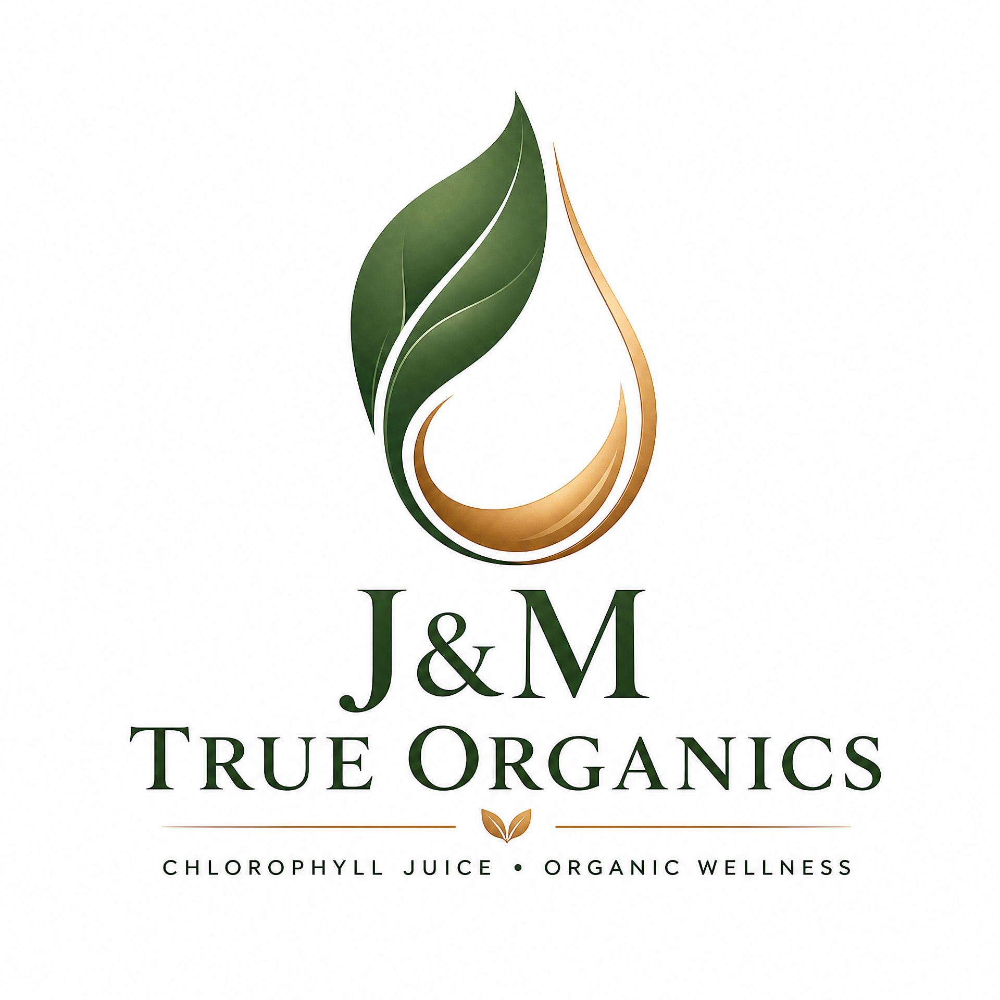

    

    
    <h1>J&M True Organics</h1>
    

        leader@johnztrueorganics.org | lesego@johnztrueorganics.org 
        +27 83 326 0018 / +27 61 110 4495 (WhatsApp) 
        Murray Avenue, Brits, North West (NW), South Africa 
        johnztrueorganics.org
    

---

**Date:** July 9, 2026

**To:** Valued Partner / Stakeholder
**Address:** South Africa

---

**Subject:** Official Communication from J&M True Organics

Dear Partner,

This letter serves as an official communication from J&M True Organics. We are dedicated to our mission of empowering holistic wellness and beauty through nature's purest organics. Our commitment to quality, sustainability, and community empowerment remains at the heart of everything we do.

We appreciate your continued support as we work together to bring health and wealth to individuals across South Africa and beyond.

---

Sincerely,

**John & Martha**
Founders, J&M True Organics

    "Discipline Today, Freedom Tomorrow" · © 2025 J&M True Organics

